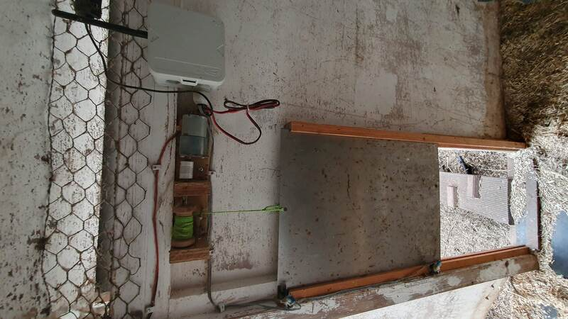
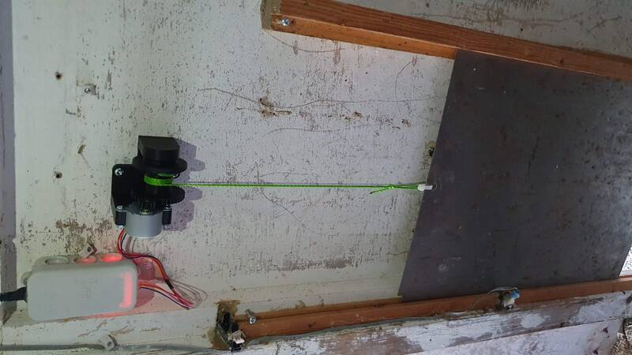
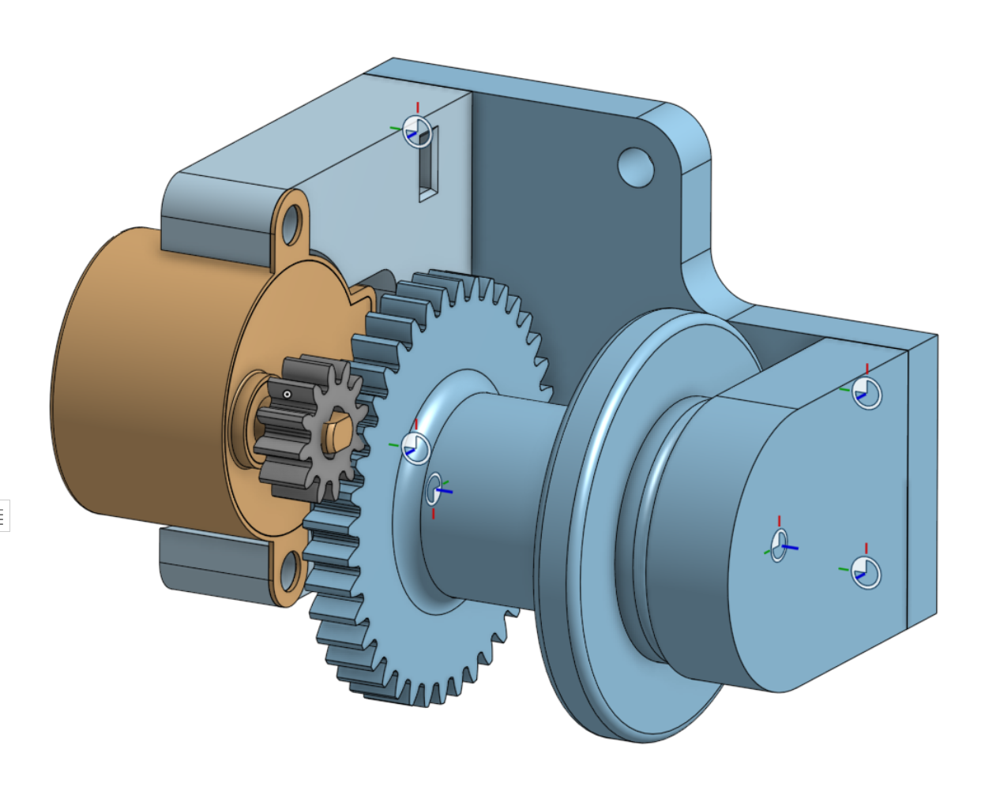

# Eggcess - chicken coop door for nerds

This is a fun, useful and educative project that combines mechanical design,
3D printing, electronics, IOT technologies and embedded programming.

This is not "just another" chicken coop door opener. In fact, this is a second generation
that I've built, with the main goal to improve *reliability* ... and a good reason to play with Micropython and learn something new.

**Features**

* sensorless operation - no risk of sensor malfunction
* safe torque - no risk of breaking something if software malfunctions
* stand-alone operation - can go without wifi connection for a long time
* auto-recovery - automatic recalibration if power was lost during movement
* MQTT interface - connect to anything
* logging saved to non-volatile memory
* web server,
* compact electronics, can be built without soldering, just use jumper wires.


## About the project


I love building smart machines and writing software in Python. These skills come in handy in many cases, so I often use my professional skills for personal (home) automation projects. With some free time around Christmas, I got back to my pet project - a fully automatic, internet-connected chicken coop door. I started this project because it's the perfect blend of fun and learning.

Time really does fly when you're having fun! This project evolved more than I anticipated, and I'm excited to share the outcome.

Initially, I thought making an automatic chicken coop door would be simple. The basic movement was indeed easy, but ensuring long-term, glitch-free operation was a whole different ball game. I started this four years ago, combining woodwork, a DC motor, and an ESP8266 microcontroller, with optical sensors for door positioning. It worked, but not flawlessly.

The first challenge I faced was the Micropython code on the ESP8266 freezing every few hours. After a lot of troubleshooting, I realized that the problem was out of my hands, likely an issue with Micropython or the chip's SDK. This led me to ESPHome, a tool that greatly simplifies firmware development. With ESPHome, you configure custom firmware using YAML, which made my coop door's firmware both robust and seamlessly integrated with my Homeassistant. However, ESPHome had its limitations too. It didn't offer complete programming freedom, and adding some 'nice-to-have' features, like automatic daylight saving time (DST) adjustments, turned out to be tricky.

Then, the mechanics and sensors faced their own set of challenges, courtesy of my lovely chickens. They managed to obstruct and 'soil" the sensors in ways I hadn't foreseen. Plus, the high-torque motor occasionally damaged the mechanics.


*V1 mechanics*

Key lessons learned:

1. Remove the sensors – fewer parts, fewer problems. A mechanical stop now precisely positions the door.
2. Replace the DC motor with a BJY48 stepper motor. Its quirks, like missing steps, prevent damage against stops. Its lower torque also means less chance of mechanical damage, albeit with slower door operation.
3. Incorporate 3D printed parts for easy replacement and reproducibility - I might build a second one.

I've recently implemented these improvements, switching to Micropython on an ESP32. Learning 3D CAD design in Onshape was a highlight, fulfilling a long-standing goal.


*new version*


The project, now named "Eggcess," is documented and available on GitHub. While 'nerds with chickens' might be a niche audience, Eggcess's principles apply broadly, like in automatic curtain openers. If you're interested in fun, practical projects using Micropython and steppers, Eggcess could be a great starting point.


------------------------------------------


## Bill of materials

* [Seed Studio XIAO - ESP32-C3](https://www.tinytronics.nl/shop/nl/development-boards/microcontroller-boards/met-wi-fi/seeed-studio-xiao-esp32-c3) - 7 €
* 2x 608ZZ ball bearing - 2x 1 €
* [BYJ48 stepper + ULN2003 driver](https://www.tinytronics.nl/shop/nl/mechanica-en-actuatoren/motoren/stappenmotoren/stappen-motor-met-uln2003-motoraansturing) - 4 €

Total of just 13 euro!

## Quick start

1. Start up VSCode devcontainer. The `Dockerfile` contains all the development goodies,
like micropython stubs. You may need to set `AMPY_PORT` in `devcontainer.json`
2. generate lookup table for open and close times using `calculations/calculate_lut.ipynb`
3. create `src/my_secrets.py` (see example file) and set correct ssid, password etc.
4. use `invoke` to upload code to the device. (`invoke upload-src`)

## Homeassistant integration

Install `mqtt` integration.

modify `mqtt` section in `configuration.yaml`:

```yaml
mqtt:
  switch:
      - unique_id: eggcess
        name: "eggcess"
        state_topic: "/eggcess/state"
        command_topic: "/eggcess/cmd"
        payload_on: "open"
        payload_off: "close"
        state_on: "open"
        state_off: "closed"
        retain: false

```


## Mechanics



Mechanical design is available on

* [onshape](https://cad.onshape.com/documents/9d1e9d13503836a93d923c99/w/cf41e9abcfc58e38551d4ef1/e/91ab2b97868868ebff4768e5?renderMode=0&uiState=6590590c9a15484af8e68a46)
* `stl` folder contains ready-to-print files.
