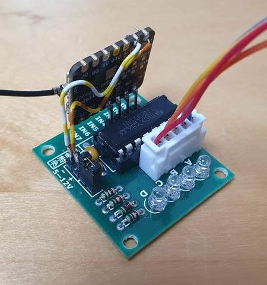

# Eggcess - chicken coop door for nerds

This is a fun, useful and educative project that combines mechanical design,
3D printing, electronics, IOT technologies and embedded programming.

This is not "just another" chicken coop door opener. In fact, this is a second generation
that I've built, with the main goal to improve *reliability* ... and a good reason to play with Micropython / Circuitpython and learn something new.


**Features**

* sensorless operation - no risk of sensor malfunction
* safe torque - no risk of breaking something if software malfunctions
* stand-alone operation - can go without wifi connection for a long time
* calculation of sunrise and sunset times
* auto-recovery - automatic recalibration if power was lost during movement
* MQTT interface - connect to anything
* logging saved to non-volatile memory
* compact electronics, can be built without soldering, just use jumper wires.


*new version*


------------------------------------------


## Quick start

**prepare pc**

* install dev requirements `pip install -r requirements_dev.txt`


**prepare board**

0. connect board via usb.
1. install circuitpython on the board
2. create `settings.toml` based on `config/settings.toml.example`. Copy it to board with `ampy put settings.toml`.
3. hard reset board.

The board should now have wifi connection


* check that the board has wifi connection. connecting with `mpremote` should provide REPL and set terminal header to board ip.
* remove `code.py` from the board
* Upload source files and lookup table:
  - serial: `invoke upload-src`
  - OR copy them manually through web interface.
* install required bundles with `circup  --host <ip> --password <pass> install -r cp_requirements.txt `


## Development
1. Start up VSCode devcontainer. The `Dockerfile` contains all the development goodies, like  stubs.
2. (optional) generate lookup table for open and close times using `calculations/calculate_lut.ipynb` if you need a more complex open-close schedule, for example different opening times during weekend, DST adjustments etc.


## Uploading files

* use `invoke` to sync files with the device over serial

      pull         Pull files from the device to the local 'dest' directory, ignoring hidden files and .syncignore patterns.
      push         Push files from the local 'src' directory to the device, ignoring hidden files and .syncignore patterns.
      upload-lut   Upload the 'sun_lut.csv' file using the CircuitPython web workflow API

* use `ampy put ...` to upload individual files over serial
* use [web workflow](https://docs.circuitpython.org/en/latest/docs/workflows.html) to manage device remotely


-------------------------------------------------------

## Homeassistant integration

Install `mqtt` integration.

modify `mqtt` section in `configuration.yaml`:

```yaml
mqtt:
  switch:
      - unique_id: eggcess
        name: "eggcess"
        state_topic: "/eggcess/state"
        command_topic: "/eggcess/cmd"
        payload_on: "open"
        payload_off: "close"
        state_on: "open"
        state_off: "closed"
        retain: false

```


## Mechanics


Mechanical design is available on

* [onshape](https://cad.onshape.com/documents/9d1e9d13503836a93d923c99/w/cf41e9abcfc58e38551d4ef1/e/91ab2b97868868ebff4768e5?renderMode=0&uiState=6590590c9a15484af8e68a46)
* `stl` folder contains ready-to-print files.


## Electronics

XIAO-ESP32-C3 pinout


soldering connections: [D0..D3] (In Micropython noted as gpio 2..5)



---------------------------------------------------------

## Bill of materials

* [Seed Studio XIAO - ESP32-C3](https://www.tinytronics.nl/shop/nl/development-boards/microcontroller-boards/met-wi-fi/seeed-studio-xiao-esp32-c3) - 7 €
* 2x 608ZZ ball bearing - 2x 1 €
* [BYJ48 stepper + ULN2003 driver](https://www.tinytronics.nl/shop/nl/mechanica-en-actuatoren/motoren/stappenmotoren/stappen-motor-met-uln2003-motoraansturing) - 4 €

Total of just 13 euro!
